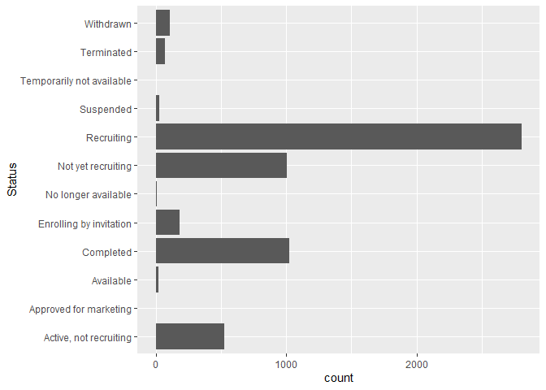
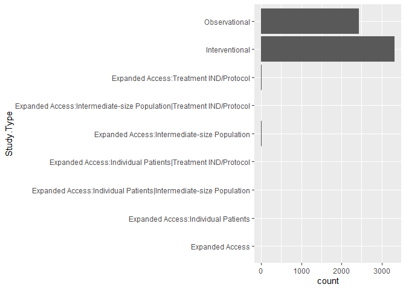
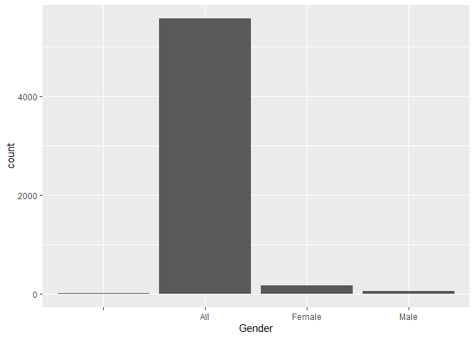
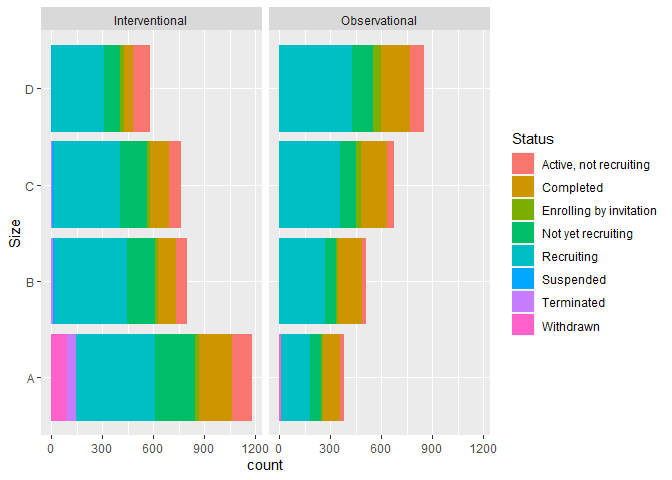
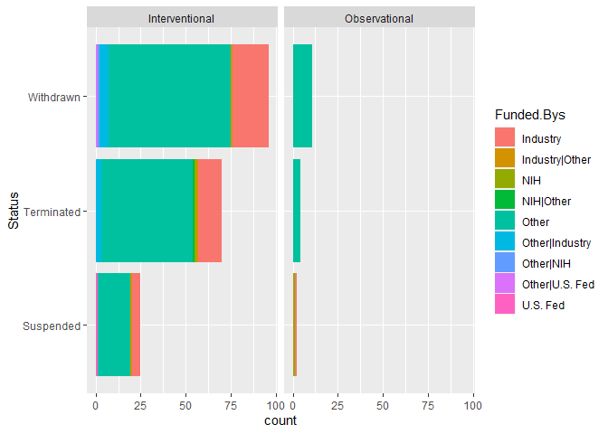
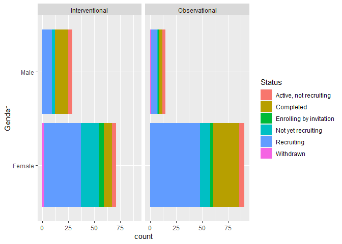

COVID trials
================
Fanyi Zeng
2/9/2022

In this project, I will analyze a dataset of COVID-19 clinical trials
conducted around the world. This dataset is from ClinicalTrials.gov,
which is maintained by the NIH.

### Load packages and data

``` r
library(tidyverse)
covid <- read.csv("data/COVID clinical trials.csv")
```

### View rows and columns

There are 5783 observations and 27 variables. Let’s take a look at what
those variables are.

``` r
view(covid)
colnames(covid)
```

    ##  [1] "Rank"                    "NCT.Number"             
    ##  [3] "Title"                   "Acronym"                
    ##  [5] "Status"                  "Study.Results"          
    ##  [7] "Conditions"              "Interventions"          
    ##  [9] "Outcome.Measures"        "Sponsor.Collaborators"  
    ## [11] "Gender"                  "Age"                    
    ## [13] "Phases"                  "Enrollment"             
    ## [15] "Funded.Bys"              "Study.Type"             
    ## [17] "Study.Designs"           "Other.IDs"              
    ## [19] "Start.Date"              "Primary.Completion.Date"
    ## [21] "Completion.Date"         "First.Posted"           
    ## [23] "Results.First.Posted"    "Last.Update.Posted"     
    ## [25] "Locations"               "Study.Documents"        
    ## [27] "URL"

### Distribution by study status

It will be interesting to see the distribution of studies by status. It
seems like most studies are recruiting (2805), some are completed
(1025), some are not yet recruiting (1004), and a few are active but not
recruiting (526).

``` r
covid %>%
  count(Status) %>%
  arrange(desc(n))
```

    ##                       Status    n
    ## 1                 Recruiting 2805
    ## 2                  Completed 1025
    ## 3         Not yet recruiting 1004
    ## 4     Active, not recruiting  526
    ## 5    Enrolling by invitation  181
    ## 6                  Withdrawn  107
    ## 7                 Terminated   74
    ## 8                  Suspended   27
    ## 9                  Available   19
    ## 10       No longer available   12
    ## 11    Approved for marketing    2
    ## 12 Temporarily not available    1

``` r
covid %>%
  ggplot(aes(y = Status)) +
  geom_bar()
```

<!-- -->

### Distribution by study types

How about the distribution of studies by types? The majority are
interventional studies (3322), followed by observational studies (2427).

``` r
covid %>%
  count(Study.Type) %>%
  arrange(desc(n))
```

    ##                                                            Study.Type    n
    ## 1                                                      Interventional 3322
    ## 2                                                       Observational 2427
    ## 3                        Expanded Access:Intermediate-size Population   15
    ## 4                              Expanded Access:Treatment IND/Protocol    8
    ## 5 Expanded Access:Intermediate-size Population|Treatment IND/Protocol    5
    ## 6                                 Expanded Access:Individual Patients    3
    ## 7                                                     Expanded Access    1
    ## 8    Expanded Access:Individual Patients|Intermediate-size Population    1
    ## 9          Expanded Access:Individual Patients|Treatment IND/Protocol    1

``` r
covid %>%
  ggplot(aes(y = Study.Type)) +
  geom_bar()
```

<!-- -->

### Distribution by gender

There are 5567 studies that include all genders, 162 female studies, and
44 male studies. It is surprising to me that there are more female
studies than male studies, because historically there were more clinical
trials and medical experiments done on males, especially white males
from Western countries.

``` r
covid %>%
  count(Gender) %>%
  arrange(desc(n))
```

    ##   Gender    n
    ## 1    All 5567
    ## 2 Female  162
    ## 3   Male   44
    ## 4          10

``` r
covid %>%
  ggplot(aes(x = Gender)) +
  geom_bar()
```

<!-- -->

### Distribution by enrollment

The 1st quartile of enrollment (sample size) is 60, 2nd quartile is 170,
3rd is 560. To make the data more managable, I divided the studies into
four groups based on their sample sizes, from smallest (A) to largest
(D). For further simplification, I also created a subset that only
contains interventional and observational studies, the two major types
of studies.

The distribution graphs show us that again, studies that are recruiting,
completed, not yet recruiting, and active but not recruiting are the
dominant groups (in descending order). We can also spot some other
patterns here - the suspended, withdrawn, and terminated studies are
mostly intervention studies. They all have small sample sizes, which
makes sense because they stopped recruiting. It might be interesting to
see what other variables are related to those discontinued studies.

``` r
summary(covid$Enrollment)
```

    ##     Min.  1st Qu.   Median     Mean  3rd Qu.     Max.     NA's 
    ##        0       60      170    18319      560 20000000       34

``` r
covid <- covid %>%
  mutate(Size = case_when(
    Enrollment <= 60 ~ "A",
    Enrollment > 60 & Enrollment <= 170 ~ "B",
    Enrollment > 170 & Enrollment <= 560 ~ "C",
    Enrollment > 560 ~ "D"
  ))
covid.subset <- covid %>%
  filter(Study.Type == "Interventional" | Study.Type == "Observational")
covid.subset %>%
  ggplot(aes(y = Size, fill = Status)) +
  geom_bar() +
  facet_wrap(~Study.Type)
```

<!-- -->

### Funding sources of discontinued studies

Maybe we can investigate the funding sources of those discontinued
studies… Unfortunately, the source information (such as “other”) is too
vague. We can only see that secondary to “other”-funded studies, a
number of industry studies did not make it.

``` r
covid.subset %>%
  filter(Status == "Suspended" | Status == "Withdrawn" | Status == "Terminated") %>%
  ggplot(aes(y = Status, fill = Funded.Bys)) +
  geom_bar() +
  facet_wrap(~Study.Type)
```

<!-- -->

### The status and types of single-gender studies

Most male, intervention studies are completed. Most female studies are
still recruiting. There are more completed, recruiting, or “not yet
recruiting” female studies than male ones. Very few male or female
studies are withdrawn, and none are suspended or terminated. This might
indicate that single-gender studies, especially female studies, are
emphasized and valued by the clinical research field.

``` r
covid %>%
  filter(Study.Type == "Interventional" | Study.Type == "Observational") %>%
  filter(Gender == "Female" | Gender == "Male") %>%
  ggplot(aes(y = Gender, fill = Status)) +
  geom_bar() +
  facet_wrap(~Study.Type)
```

<!-- -->
